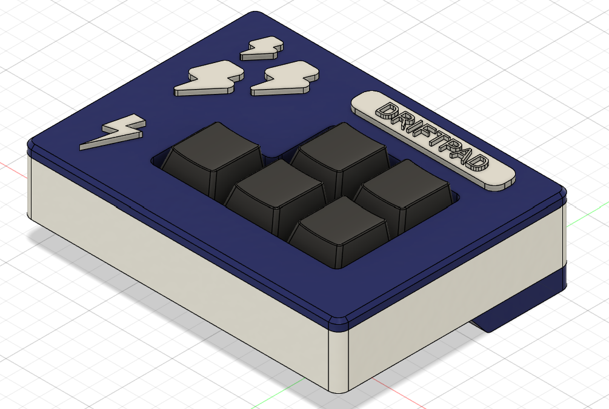
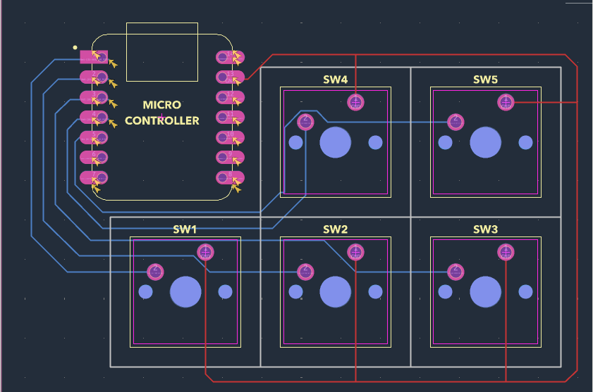
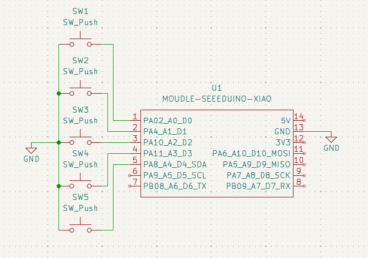

# coolkeeb (driftpad)
A cool little keyboard with 5 keys i made to play Asphalt without using the whole keyboard. A pretty simple project in terms of complexity, but i spen a lot of time and effort building this. One of my first ever proper hardware projects :D

## Features
- Completely 3D printed casing
- 5 key switches
- Uses QMK firmware
- Customizable case and colors

## About the case
The top plate snaps into the container perfectly with exact tolerence. It has 3 parts: the top plate, the container, and the angle supporter (supposed to be glued on). Aditionally, i added some decorations like thunderolts that can be fitted onto the top plate as well! I went with blue and white for the case this time, as i thought it looked cool!

## The PCB
Here are the images of the PCB and the schematic. Very simple as i do not know much in this field of work :D

## Firmware Overview
This hackpad uses QMK firmware.

- The 5 keys currently act as macros I dynamically change in my code.

Thats all for now, i may add other stuff now, this is just the basic version

## BOM
This is all you need to make this yourself, nothing too much :D
5x Cherry MX Switches
5x DSA Keycaps (I 3d printed these mysef tho)
1x XIAO RP2040
1x Case (3 printed parts)